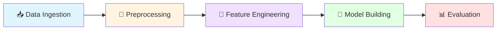

<div align="center">

# 🚀 ML Pipeline with DVC

### *Production-Grade Machine Learning Pipeline with Version Control*

[](https://www.python.org/downloads/)
[](https://dvc.org/)
[](https://scikit-learn.org/)
[](LICENSE)

*Reproducible • Scalable • Version Controlled*

[Features](#-features) • [Quick Start](#-quick-start) • [Pipeline](#-pipeline-architecture) • [Documentation](#-documentation)

---

</div>

## 📋 Overview

A **production-ready end-to-end machine learning pipeline** for sentiment analysis that leverages **Data Version Control (DVC)** to ensure reproducibility, traceability, and scalability. This project demonstrates industry best practices for ML operations, from data ingestion to model evaluation.

### 🎯 What Makes This Special?

- 🔄 **Fully Reproducible**: Every experiment is tracked and can be replayed
- 📊 **Data Versioning**: Git for data - track datasets like code
- 🎭 **Modular Design**: Clean separation of concerns across pipeline stages
- 📈 **Performance Tracking**: Automated metrics collection and comparison
- 🔧 **Production Ready**: Structured for easy deployment and scaling

---

## ✨ Features

| Feature | Description |
|---------|-------------|
| 🗂️ **Data Version Control** | Track and version datasets using DVC |
| 🔄 **Automated Pipeline** | 5-stage ML pipeline with dependency management |
| 🧹 **Advanced NLP** | Text preprocessing with lemmatization, stopword removal, and normalization |
| 🎨 **Feature Engineering** | Bag-of-Words vectorization for text representation |
| 🤖 **Gradient Boosting** | High-performance GradientBoostingClassifier |
| 📊 **Metrics Tracking** | Accuracy, Precision, Recall, and AUC monitoring |
| 🔍 **Reproducibility** | Complete experiment tracking and replay capability |

---

## 🏗️ Pipeline Architecture



### Pipeline Stages

| Stage | Input | Output | Description |
|-------|-------|--------|-------------|
| **1. Data Ingestion** | 🌐 Remote CSV | `data/raw/` | Fetches tweet emotions dataset and splits train/test |
| **2. Preprocessing** | `data/raw/` | `data/processed/` | Text normalization, cleaning, and lemmatization |
| **3. Feature Engineering** | `data/processed/` | `data/features/` | Converts text to numerical features (BoW) |
| **4. Model Building** | `data/features/` | `model.pkl` | Trains GradientBoostingClassifier |
| **5. Model Evaluation** | `model.pkl` | `metrics.json` | Calculates performance metrics |

---

## 🚀 Quick Start

### Prerequisites

```bash
Python 3.8+
Git
DVC
```

### Installation

1️⃣ **Clone the repository**
```bash
git clone https://github.com/NayeemHossenJim/ML-Pipeline-using-DVC.git
cd ML-Pipeline-using-DVC
```

2️⃣ **Install dependencies**
```bash
pip install -r requirements.txt
```

3️⃣ **Initialize DVC** (if not already done)
```bash
dvc init
```

4️⃣ **Run the complete pipeline**
```bash
dvc repro
```

That's it! 🎉 The pipeline will execute all stages automatically.

---

## 📂 Project Structure

```
ML-Pipeline-using-DVC/
│
├── 📄 dvc.yaml                 # DVC pipeline configuration
├── 📊 metrics.json             # Model performance metrics
├── 📋 requirements.txt         # Python dependencies
├── 🤖 model.pkl               # Trained model artifact
│
├── 📁 data/
│   ├── raw/                   # Original datasets
│   ├── processed/             # Cleaned and normalized data
│   └── features/              # Engineered features (BoW)
│
└── 📁 src/
    ├── data_ingestion.py      # Stage 1: Fetch and split data
    ├── data_preprocessing.py  # Stage 2: Text cleaning
    ├── feature_engineering.py # Stage 3: Feature extraction
    ├── model_building.py      # Stage 4: Model training
    └── model_evaluation.py    # Stage 5: Performance evaluation
```

---

## 🎯 Current Performance

```json
{
    "accuracy":  66.70%  
    "precision": 77.74%  
    "recall":    44.73%  
    "auc":       72.28%  
}
```

> 💡 **Tip**: Run experiments with different parameters and let DVC track the changes!

---

## 🔧 Usage

### Run Specific Pipeline Stage

```bash
# Run only data ingestion
dvc repro data_ingestion

# Run up to feature engineering
dvc repro feature_engineering
```

### View Pipeline DAG

```bash
dvc dag
```

### Compare Metrics Across Experiments

```bash
dvc metrics show
dvc metrics diff
```

### Track Data Changes

```bash
dvc status
dvc push  # Push data to remote storage
dvc pull  # Pull data from remote storage
```

---

## 🛠️ Technology Stack

<div align="center">

| Category | Technologies |
|----------|-------------|
| **ML Framework** |   |
| **Data Processing** |   |
| **NLP** |  |
| **Version Control** |   |
| **Language** |  |

</div>

---

## 📚 Documentation

### Data Preprocessing Steps

1. **Lowercasing**: Normalize text case
2. **URL Removal**: Strip hyperlinks
3. **Number Removal**: Remove numeric characters
4. **Punctuation Removal**: Clean special characters
5. **Stopword Removal**: Filter common words
6. **Lemmatization**: Reduce words to base form

### Model Details

- **Algorithm**: Gradient Boosting Classifier
- **Estimators**: 50 trees
- **Task**: Binary sentiment classification (happiness vs sadness)
- **Feature Representation**: Bag-of-Words (50 features)

---

## 🔄 Workflow

```bash
# 1. Make changes to code or data
nano src/model_building.py

# 2. Run the pipeline
dvc repro

# 3. Check what changed
dvc metrics diff

# 4. Commit changes
git add .
git commit -m "Improved model performance"

# 5. Push code and data
git push
dvc push
```

---

## 🎓 Learning Resources

- [DVC Documentation](https://dvc.org/doc)
- [Scikit-learn User Guide](https://scikit-learn.org/stable/user_guide.html)
- [NLTK Book](https://www.nltk.org/book/)
- [ML Pipeline Best Practices](https://ml-ops.org/)

---

## 🤝 Contributing

Contributions are welcome! Feel free to:

1. 🍴 Fork the repository
2. 🔧 Create a feature branch (`git checkout -b feature/AmazingFeature`)
3. 💾 Commit your changes (`git commit -m 'Add some AmazingFeature'`)
4. 📤 Push to the branch (`git push origin feature/AmazingFeature`)
5. 🎉 Open a Pull Request

---

## 🐛 Troubleshooting

<details>
<summary><b>DVC repro fails</b></summary>

```bash
# Clean the cache and retry
dvc gc -w
dvc repro -f
```
</details>

<details>
<summary><b>NLTK data not found</b></summary>

```python
import nltk
nltk.download('wordnet')
nltk.download('stopwords')
```
</details>

<details>
<summary><b>Permission errors on Windows</b></summary>

Run PowerShell as Administrator or adjust folder permissions.
</details>

---

## 📜 License

This project is licensed under the MIT License - see the [LICENSE](LICENSE) file for details.

---

## 👨‍💻 Author

**Nayeem Hossen Jim**

- GitHub: [@NayeemHossenJim](https://github.com/NayeemHossenJim)
- Repository: [ML-Pipeline-using-DVC](https://github.com/NayeemHossenJim/ML-Pipeline-using-DVC)

---

## 🌟 Show Your Support

If you found this project helpful, please consider giving it a ⭐️!

---
</div>
